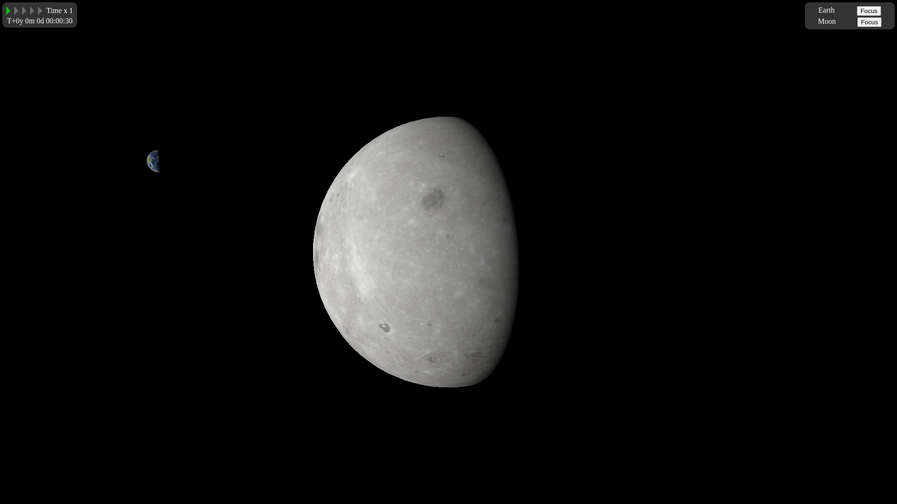
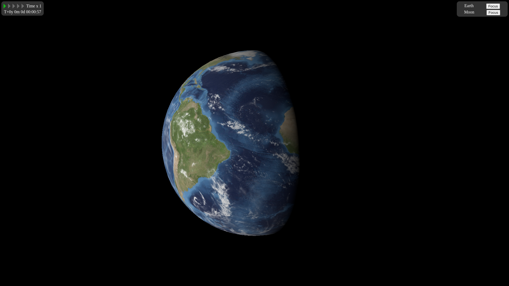
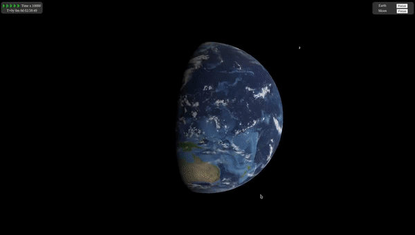

# Space Simulation


Space Simulation is a TypeScript project that simulates the Earth-Moon system using the Three.js library. It provides a visually appealing and interactive representation of the celestial bodies.

## Features

- Realistic simulation of the Earth and Moon in a 3D environment
- Accurate representation of their relative positions and movements
- Interactive controls to navigate and explore the simulation
- Dynamic lighting and shading effects for enhanced visuals

## Installation

1. Clone the repository:

   ```bash
   git clone https://github.com/your-username/space-simulation.git
   ```

2. Navigate to the project directory:

   ```bash
   cd space-simulation
   ```

3. Install the dependencies:

   ```bash
   npm install
   ```

## Usage

To run the simulation, execute the following command:

```bash
npm start
```

This will launch the application in your default browser. You can then interact with the simulation using your mouse and keyboard controls.

## Screenshots




## Demo

Check out the following animated GIF to see the Space Simulation in action:



## Contributing

Contributions are welcome! If you have any ideas, suggestions, or bug reports, please create an issue or submit a pull request.

## License

This project is licensed under the [MIT License](LICENSE).